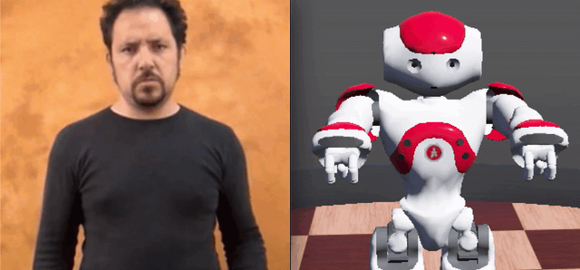
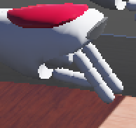
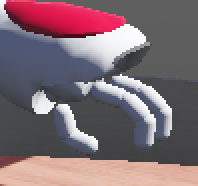
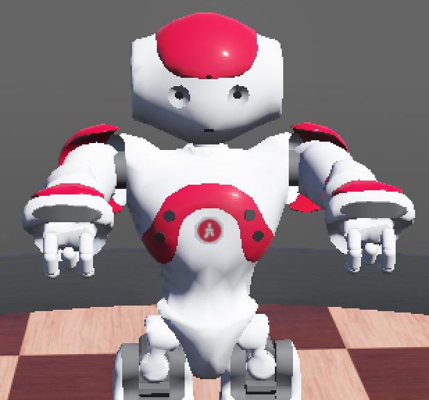
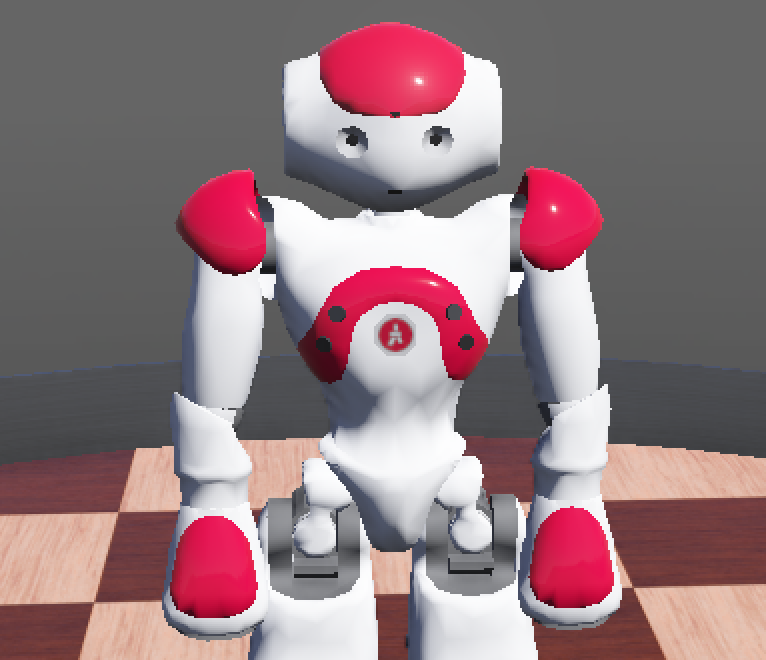

# NAO Robot - Italian Sign Language
Educational project for [Social Robot](https://www.unibo.it/it/didattica/insegnamenti/insegnamento/2019/432427) university course at University of Bologna.

**NAO-ISL DEMO**



## Table Of Content
* [Introduction](#introduction)
* [Getting Started](#getting-started)
    * [Prerequisites](#prerequisites)
    * [Install](#install)
    * [Run](#run)
* [The Dictionary](#the-dictionary)
    * [Available signs](#available-signs)
    * [How to add new signs](#how-to-add-new-signs)
* [Motions](#motions)
    * [Available motions](#available-motions)
    * [How to add new motions](#how-to-add-new-motions)
* [Authors](#authors)

## Introduction
The project consists in the development of an educational social robot 
to be used at home and/or school to support the learning of **deaf** people. 
In particular, this is a "gamification" project that 
allows users to learn the **Italian Sign Language (ISL)**  through 
a playful activity provided by the robot. 
The user chooses, among a list, the verb he wants to learn, 
then the robot execute the corresponding sign. 
For this purpose, we have chosen [NAO robot](https://www.softbankrobotics.com/emea/en/nao), a small humanoid robot that can 
replicate human gestures and movements. 

Four main components have been identified to describe a sign:
* **location**: place where the sign takes place (e.g. head, chest).
* **hand configuration**: position of the involved hand parts in the sign. 
* **hand orientation**: orientation of the hand parts involved in the sign (degrees).  
* **movement**: how the movement for the sign is performed (e.g. circular movement of the arm).

Using only these four components, it's possible to define a sign! 
(See [The Dictionary](#the-dictionary) section to find out how 
you can define a sign).

The **location** is also used to improve the interaction with the user. 
The place of execution of a sign is influenced by its 
category. For example, verbs that refer to an emotion are executed near the chest. 
The robot uses this categorization to propose verbs that have the same 
location as the verb he chooses.

For more info about this project see the [project report](#https://docs.google.com/document/d/1m6vXoOU6egTS8wqGPw0tCY2PNoAa5-cMNVSIy8bD4r8/edit?usp=sharing).

## Getting Started
### Prerequisites
This project is tested on `Python 2.7`.

Before proceeding, install [Webots](https://cyberbotics.com) following the [official guide](https://cyberbotics.com/doc/guide/installing-webots).

### Install
* Clone this repository:
```
git clone https://github.com/FaMoSi/SocialRobot-ISL
```

* Change into it:
```
cd SocialRobot-ISL
```

* Edit the `local_path` in [utils.py](./utils.py). It has to points to the `SocialRobot-ISL` cloned repository.

That's all, everything is installed and you can run the NAO-ISL robot!

### Run
You can run the project following these steps:
* **Open** [Webots](https://cyberbotics.com).
* From the menu bar **click** on `File -> Open World...`.
* **Select and open** the [LIS-Nao-simple.wbt](worlds/LIS-Nao-simple.wbt) or [LIS-Nao-apartment.wbt](worlds/LIS-Nao-apartment.wbt) world file. You can find it in `~/SocialRobot-ISL/worlds/`
* **Click** the ["Play" button](https://cyberbotics.com/wwi/R2019a/help.php) of Webots.
* **Follow the instructions** shown in the console.


There are two worlds in [./worlds](./worlds):
* [LIS-Nao-apartment.wbt](worlds/LIS-Nao-apartment.wbt): here NAO is placed in a small apartment. Using this world require more computational resources. However, it is useful to show the dimension of the robot.
* [LIS-Nao-simple.wbt](worlds/LIS-Nao-simple.wbt): here NAO is placed in a simple world. Consider using this world to play with the robot.

**NB: The robot waits for pressed key. Make sure the 3D window of [Webots](https://cyberbotics.com) is selected and the simulation is running.**
## The Dictionary
[The dictionary](./sign_dictionary.json) is where signs are defined. 
It is a `.json` file with following format:
```
{
  "name_sign": [
    # RIGHT-SIDE
    {
      "location": location_value,
      "hand_configuration": hand_configuration_value,
      "hand_orientation": hand_orientation_value,
      "movement": [movement_value_1, movement_value_2, ..., movement_value_n],
      "movement_speed" movement_speed_value
    },
    # LEFT-SIDE
    {
      "location": location_value,
      "hand_configuration": hand_configuration_value,
      "hand_orientation": hand_orientation_value,
      "movement": [movement_value_1, movement_value_2, ..., movement_value_n]
      "movement_speed" movement_speed_value
    }
  ],
  .....
}
```
**Each sign has two entries:**
The first one (#RIGHT-SIDE) defines how the **right** side (e.g. right hand, right shoulder, etc.) 
of the robot performs the sign, while the second one (#LEFT-SIDE) is related to the **left** side.
**The right and left definitions are independent!**

Here is an explanation of each parameter:
* `location`: **string** - where the sign take place. 
* `hand_configuration`: **string** - the shape of the hand. (**string**)
* `hand_orientation`: **int** - where the wrist is facing. This value is expressed in degrees **from -180 (facing the listener) to +180 (facing the robot)**. (**int**)
* `movement`: **\[string\]** - what type of movement must be executed. It's possible to add more than one `movement_value`. 
if that's the case, they are executed with their definition order.
* `movement_speed`: **\[int\]** - the speed of the movement in **seconds**.


**NB:**
* Each entry (Left and Right) has 4 parameters. 
Their values are the name of the related `.motion` file and **it must be defined**. 
Every parameter has is own directory ([./motions/\[parameter\]](./motions)) with his motions.
Please, see the [Motions](#motions) section
to check available motions and find out how you can add new ones!
* The *order* of parameters declaration **matters**!! They are executed in the order they are defined. 
For example, if you have this order:
```
...{
"location": location_value,
"hand_configuration": hand_configuration_value,
"hand_orientation": hand_orientation_value,
"movement": [movement_value_1, movement_value_2, ..., movement_value_n]
"movement_speed": movement_speed_value
}...
```
the robot execute the sign in this order: 
* place the arms in the correct `location`.
* moves hand actuators to the `hand_configuration`.
* rotate the wrist by `hand_orientation` degrees.
* perform the `movement

* For the `movement_speed` parameter the order doesn't affect the order of execution


### Available Signs
The signs for the following verbs are already defined in the [sing dictionary](./sign_dictionary.json):
* Mental Activity (**Head** Location):
    * Think 
    * Know 
    * Remember
    * Forget
    * Reason 
* Emotions (**Chest** Location):
    * Angry
    * Jealousy
    * Trust 
    * Envy
    * Love

### How to add new signs
#### Let's add a new sign defintion to the [dictionary](./sign_dictionary.json):
* **open** the [sing dictionary.json](./sign_dictionary.json) file.
* **copy and paste** this code fragment:
```
"name_sign": [
    {
      "location": location_value,
      "hand_configuration": hand_configuration_value,
      "hand_orientation": hand_orientation_value,
      "movement": [movement_value_1, movement_value_2, ..., movement_value_n],
      "movement_speed": movement_speed_value
    },
    {
      "location": location_value,
      "hand_configuration": hand_configuration_value,
      "hand_orientation": hand_orientation_value,
      "movement": [movement_value_1, movement_value_2, ..., movement_value_n],
      "movement_speed": movement_speed_value
    }
  ]
```
* replace: 
    * `name_sign` with the name of the new sign.
    * `[parameter]_value` with the name of the motion you want to infer to the corresponding parameter.

#### Now we need to assign a pressed key to the new defined sign:
* **open** the [controlle_lis.py](./controllers/controller_lis/controller_lis.py) file.
* **uncomment** [this code fragment](https://github.com/FaMoSi/SocialRobot-ISL/blob/59b83af3e238a5d30099c847586b834ccf9cc7a4/controllers/controller_lis/controller_lis.py#L216):
```
"""
if key == ord('NEW_KEY'):
  sign = "new_sign"
"""
```
* **replace**:
    * `NEW_KEY` with the **new key** you want to be pressed (**Uppercase letter**) 
    * `new_sign` with the `name_sign` you defined before.

**Now you can perform the new sign!!** (follow the instructions given in the [Getting Started](#getting-started) section).


## Motions
In this section are presented, for each parameter (location, hand_configuration, hand_orientation, movement), 
what's the nomenclature pattern for theirs **available `motions`**. 

In case you'll add new motion, it's highly recommended to use the same pattern when naming the file `.motion`,
in order to maintain a consistent nomenclature (see [How to add new motions](#how-to-add-new-motions)).

### Available Motions
<details>
<summary><b><i>hand_configuration</i></b></summary>
The <b>configuration</b> motions refer to specific <b>hand</b> configurations.
Their names can be <b>figurative</b> or <b>explicative</b>. 
<br>
To avoid confusion, here are shown the configurations for the <b>figurative</b> names:
<br>
<br>

Beak            |  Scratch
:-------------------------:|:-------------------------:
  |  
<br>
<br>

Pattern for <b>explicative</b> names:
```
[open/close]_[phalanges]_[R/L].motion
```
This means: "for the **Right/Left** hand, the phalanges **phalanges** are **open/close**"


</details>


<details>
<summary><b><i>location</i></b></summary>
The <b>location</b> motions refer to where the sign takes place.
Their names are <b>explicative</b>. 

Pattern for <b>explicative</b> names:
```
[body_part]_[fornt/side]_[R/L].motion
```
This means: "for the **Right/Left** arm, the sign takes place in **front/side** of the **body_part**"
</details>

<details>
<summary><b><i>movement</i></b></summary>
The <b>movement</b> motions refer to how the sign is performed.
Their names can be <b>figurative</b> or <b>explicative</b>.

The only <b>figurative</b> two names are used for the `rest_position` and the `rest_position_natural`. 
* `rest_position`: neutral position of the robot (all actuators value equals to 0).
* `rest_position_natural`: neutral position of humans.

Rest Position            |  Rest Position Natural
:-------------------------:|:-------------------------:
  |  

Pattern for <b>explicative</b> names in case the involved body part is **hand**:
```
hand_[phalanges]_[type_of_movement]_[R/L].motion
```
This means: "for the **Right/Left** hand, the phalanges **phalanges** perform the movement **type_of_movement**"

Pattern for <b>explicative</b> names in general:
```
[body_part]_[type_of_movement]_[R/L].motion
```
This means: "the **Right/Left** **body_part** performs the movement **type_of_movement**"

</details>

<details>
<summary><b><i>hand_orientation</i></b></summary>
The <b>hand_orientation</b> motions refer to specific rotation angle of the **wrist**.
Their names are <b>explicative</b>.

Pattern for <b>explicative</b> names:
```
[+/-Degree]_[R/L].motion
```
This means: "the **Right/Left** hand (wrist), has the orientation of **Degree** degrees.
* **+**\[degree\]: facing the robot.
* **-**\[degree\]: facing the listener.

</details>

### How to add new motions
You may want to add new motions in order to define new signs.
Here is a brief introduction to how a `.motion` file is structured, then a short explanation about how to add a ready-to-use motion.

Here is an example of `.motion` file:
```
#WEBOTS_MOTION,V1.0,LShoulderRoll,LElbowRoll
00:00:000,Pose1,0.1,-1.3
00:00:200,Pose2,-0.1,-1.45
00:00:400,Pose3,-0.2,-1.45
00:00:600,Pose4,-0.3,-1.45
00:00:800,Pose5,-0.3,-1.3
00:01:000,Pose6,-0.3,-1.2
00:01:200,Pose7,-0.2,-1.2
00:01:400,Pose8,+0.1,-1.2
```
The **first line** (`#WEBOTS_MOTION,V1.0,[ACTUATOR]`) defines that this is a `#WEBOTS_MOTION` file that uses the `V1.0` version.
Then follows a declaration of interested actuators (in this case, `LShoulderRoll` and `LElbowRoll`).

Each of the other lines (`min:sec:millisec,Pose*,+/-Value`) defines that, at time `min:sec:millisec`, the pose `Pose*` has the value `+/-Value` for the corespondent actuator.
In the example above, we have that: 
* at time `00:00:000`, `LShoulderRoll` has the value `0.1` and `LElbowRoll` has the value `-1.3`.
* at time `00:00:200`, `LShoulderRoll` has the value `-0.1` and `LElbowRoll` has the value `-1.45`.
* and so on ...

If you want to **add a new motion**, follow these steps:
* **create** a new file `[name_of_the_motion].motion` inside the **corespondent directory**. 
For example, if you want to add a new `hand_configuration` motion, create the `.motion` file in [./motions/hand_configuration](motions/hand_configuration)
* **copy and paste** this code fragment:
```
#WEBOTS_MOTION,V1.0,[ACTUATOR_1],[ACTUATOR_2],...,[ACTUATOR_N]
00:00:000,Pose1,[VALUE_1],[VALUE_2],...,[VALUE_N]
00:00:200,Pose2,[VALUE_1],[VALUE_2],...,[VALUE_N]
```
* **replace**:
    * `[ACTUATOR_*]` with interested actuators. **You can find available actuators [here](https://cyberbotics.com/doc/guide/nao).**
    * `[VALUE_*]` with the value you want to infer to the corespondent actuator. **You can find accepted values for each actuator [here](https://cyberbotics.com/doc/guide/nao)**

## Authors
**[Simone Faggi](https://github.com/FaMoSi)** & **[Pietro Lami](https://github.com/PietroLami)**

